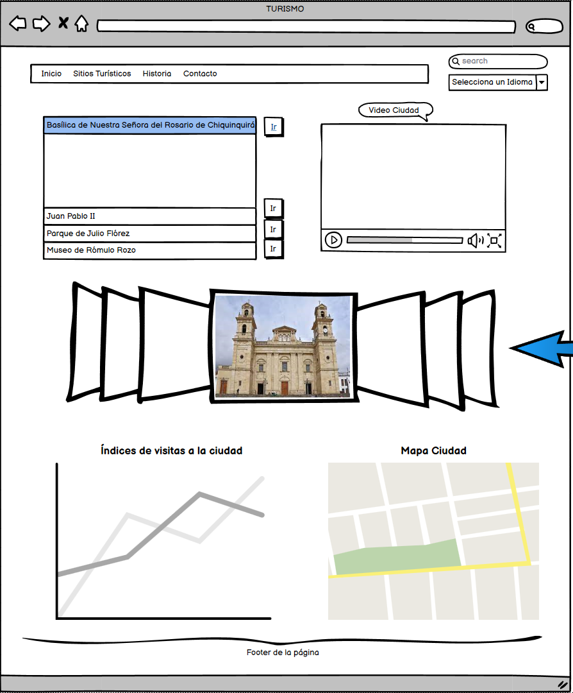

# Turismo Chiquinquirá | Gestión de proyectos

La ciudad de Chiquinquirá Boyacá es conocida por ser la capital religiosa de Colombia y por la Basílica de Nuestra Señora del Rosario de Chiquinquirá, un importante destino de peregrinación que alberga la venerada imagen de la Virgen de Chiquinquirá. 





## Características Principales

- Información sobre el turismo en chiquinquirá
- Lugares más recorridos
- Distintos Sitios Turisticos
- Basílica nuestra señora del rosario


## Clonar repositorio

Para clonar este repositorio lo debes hacer con el siguiente comando.

```bash
  git clone https://github.com/NesniDev/proyectoG75.git
```


## Autor

- [@neidernieto](https://github.com/NesniDev)
